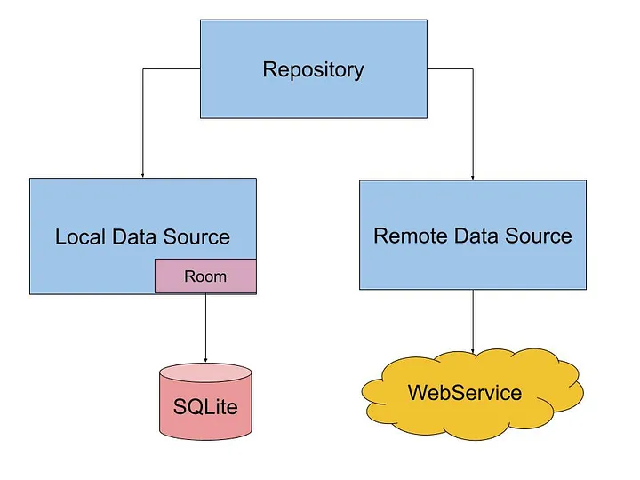

# Kotlin Local and Remote


## Acerca de

Este proyecto es un ejemplo de como crear un servicio para el almacenamiento de datos Kotlin.

Tendremos un repositorio local usando una base de datos, y un repositorio remoto utilizando una API REST.

Ambos repositorios estarán encapsulados en un solo servicio, que será el que utilicemos en nuestra aplicación.
Es decir, cada cierto tiempo se actualizará la base de datos local con los datos de la API REST. Otro caso de uso es que
no haya conexión, o simplemente
queramos trabajar con los datos locales o si no se encuentran actualizados, con los datos de la API REST.
Además, otra caché en memoria se encargará de almacenar los últimos datos obtenidos de la base de datos local o de la
API REST para mejorar el rendimiento de la aplicación. Es decir, si la base de datos local no está actualizada, se
obtendrán los datos de la API REST cada cierto intervalo de refresco y se almacenarán en la base de datos local. En la
caché
en memoria se almacenarán los últimos datos obtenidos de la base de datos local o de la API REST.

El intervalo de refresco de la base de datos local y el de la caché en memoria se puede configurar.

Por otro lado, el servicio podrá importar/exportar datos en CSV y JSON.

Finalmente, tendremos un servicio de notificaciones, que nos permitirá recibir información de los cambios realizados.

El objetivo docente es mostrar implementaciones asíncronas y reactiva en el procesamiento de la información.

Puedes seguir el proyecto en [GitHub](https://github.com/joseluisgs/KotlinLocalAndRemote) y en los commits indicados.

```
El proyecto está sobre-exagerado para mostrar diferentes técnicas y no es un ejemplo de cómo hacer una aplicación real.
Se trata de elementos aislados que se pueden utilizar en una aplicación real con el objetivo que el alumnado identifique
y asimile nuevas técnicas y herramientas de programación. No tiene que ser la mejor forma ni la más eficiente, pero sí
intenta acercar otras formas de programar nuevas que se están viendo en clase. El objetivo es aprender y no hacer una
aplicación real y eficiente. 
```

La idea subyacente es el famoso patrón de diseño Repository usado en Android, pero llevado a un nivel superior.



## Programación asíncrona y reactiva

La
programación [asíncrona](https://sunscrapers.com/blog/programming-async-vs-sync-best-approach/)
es un modelo de programación que permite realizar tareas en segundo plano sin bloquear el hilo
principal de
la aplicación.
La [reactividad](https://www.baeldung.com/cs/reactive-programming#:~:text=Reactive%20programming%20is%20a%20declarative,or%20reactive%20systems%20in%20general.)
es un modelo de programación que permite reaccionar a eventos de forma rápida y eficiente.
La programación reactiva es un paradigma de programación declarativa que se basa en la idea del procesamiento asíncrono
de eventos y flujos de datos.

En Kotlin, la programación asíncrona y reactiva se puede realizar
con [Coroutines](https://kotlinlang.org/docs/coroutines-overview.html)
y [Flows](https://kotlinlang.org/docs/flow.html). Las Coroutines son tareas que
se pueden suspender y
reanudar. De esta manera, se pueden realizar tareas en segundo plano
y nos permiten realizar operaciones asíncronas de forma sencilla y eficiente. Los Flows son secuencias de valores que se
pueden emitir de forma asíncrona. De esta manera, se pueden
realizar operaciones reactivas de forma sencilla y eficiente.

## Railway Oriented Programming

El [Railway Oriented Programming](https://fsharpforfunandprofit.com/rop/) (ROP) es un estilo de programación que se basa
en el uso de funciones que devuelven un
resultado. De esta manera, se pueden encadenar operaciones de forma sencilla y eficiente. En Kotlin, el ROP se puede
realizar con la clase Result. La clase Result es una clase que representa un resultado exitoso o un resultado fallido.
De
esta manera, se pueden realizar operaciones de forma sencilla y eficiente.

Para ello debemos entender que es el Happy Path y el Error Path. El Happy Path es el camino feliz, es decir, el camino
que se espera que se siga. El Error Path es el camino de error, es decir, el camino que se sigue cuando se produce un
error.

De esta manera podemos encadenar operaciones de forma sencilla y eficiente. Si una operación falla, se sigue el Error
Path. Si una operación tiene éxito, se sigue el Happy Path.

## Almacenamiento y Serialización

El primer paso es crear un servicio de almacenamiento y serialización de datos para realizar las operaciones de lectura
y escritura de datos. Para ello, crearemos una interfaz `StorageService` que definirá las operaciones de lectura y
escritura.

Luego, crearemos una implementación de esta interfaz para almacenar los datos en formatos CSV y JSON.
Para facilitar la serialización y deserialización de los datos, utilizaremos la librería de
Kotlin [`kotlinx.serialization`](https://kotlinlang.org/docs/serialization.html).

Haremos uso de mapeadores para convertir los datos de un formato a otro. Para ello haremos uso de las [funciones de
extensión de Kotlin](https://kotlinlang.org/docs/extensions.html). Estas funciones nos permiten añadir nuevas
funcionalidades a las clases sin modificarlas. En este
caso añadiremos
funciones de extensión para convertir los datos de un formato a otro.

En todo momento trabajaremos la asincronía con [Flows](https://kotlinlang.org/docs/flow.html) y trabajaremos ROP con
[Result](https://github.com/michaelbull/kotlin-result).

Enlace a
los [commit de la sección](https://github.com/joseluisgs/KotlinLocalAndRemote/tree/f4cf8d903a9ecb80f36822d870144ea2b8defd57).

## Cache en Memoria

Para realizar la caché en memoria, crearemos una interfaz genérica `Cache` que definirá las operaciones de lectura y
escritura de datos.

Ene ste momento tenemos dos alternativas: FIFO y LRU.

- FIFO: First In First Out, es decir, el primer elemento que entra es el primero en salir. Como ventajas es más sencillo
  de implementar, no necesita de un contador de accesos ni de un contador de tiempo. Como desventajas no tiene en cuenta
  la frecuencia de uso de los elementos, ni el tiempo de uso de los elementos, ni la importancia de los elementos.
- LRU: Least Recently Used, es decir, el elemento menos recientemente usado es el primero en salir. Como ventajas tiene
  en cuenta la frecuencia de uso de los elementos, el tiempo de uso de los elementos y la importancia de los elementos.
  Como desventajas es más complejo de implementar, necesita de un contador de accesos y de un contador de tiempo.

Para la implementación de la caché en memoria con LRU usaremos un truco si conoces bien las colecciones
como `LinkedHashMap` que nos permite
ordenar los elementos por el orden de inserción. De esta forma, el primer elemento que se inserta es el primero en
salir. Si usamos
un `LinkedHashMap` con `accessOrder` a `true`, los elementos se ordenarán por el orden de acceso, es decir, el último
elemento accedido
será el último en salir. Además, si implementamos un `removeEldestEntry` podemos controlar el tamaño de la caché y
eliminar el elemento menos
recientemente usado.

Enlace a
los [commit de la sección](https://github.com/joseluisgs/KotlinLocalAndRemote/tree/7003a44892d4c540530e78b31e6123d4c8e882a5).

## Repositorio Local

Para la realización del repositorio local, hemos usado SQLite [SQLDelight](https://cashapp.github.io/sqldelight/2.0.2/),
una librería que nos permite definir las
tablas y las consultas en un archivo `.sq` y generar el código necesario para interactuar con la base de datos.

Para ello, hemos creado un archivo `.sq` con la definición de la tabla y las consultas necesarias. Luego, hemos
configurado el plugin de SQLDelight en el `build.gradle` para que genere el código necesario.

Para la implementación del repositorio local, hemos creado una interfaz `Repository` que define las operaciones de
lectura y escritura de datos. Seguimos usando asincronía con Flows y trabajando ROP con Result.

De esta manera hemos podido separar la lógica de la base de datos de la lógica de la aplicación.

Enlace a
los [commit de la sección](https://github.com/joseluisgs/KotlinLocalAndRemote/tree/39d0e8c0a2e0fb2c5b6d80fe10b9c50ce1019385).

## Repositorio Remoto

Para la realización del repositorio remoto, hemos usado [KtorFit](https://foso.github.io/Ktorfit/), una librería que nos
permite realizar peticiones a
una API REST de forma sencilla y eficiente basada en Ktor y cogiendo las ideas de Retrofit.

Para ello, hemos creado una interfaz para definir las operaciones de la API REST y una implementación de un repositorio
donde
usando KtorFit realizamos las peticiones a la API REST.

Una de las ventajas de KtorFit es que nos permite definir las operaciones de la API REST de forma sencilla y eficiente
de manera asíncrona. Por otro lado
nos permite definir el tipo de resultado que queremos: Response, Flow, etc. o definir el nuestro propio, como es el caso
que hemos hecho implementando
nuestra propia respuesta basada en Result y seguir con la filosofía de ROP.

Enlace a
los [commit de la sección](https://github.com/joseluisgs/KotlinLocalAndRemote/tree/f519fb861d60298c88eb64e578206fcd3c31dacd).

## Validador

Para la realización del validador de datos, hemos usado una función de extensión de Kotlin que nos permite validar los
datos de forma sencilla y eficiente.

Enlace a
los [commit de la sección](https://github.com/joseluisgs/KotlinLocalAndRemote/tree/f38b4233d4378a29fa16d314ede3f8281c6d9378).

## Notificaciones

Para la realización del servicio de notificaciones, hemos hecho uso de dos clases de la familia de los Flows que nos
pueden ayudar a ello:

- [SharedFlow](https://kotlinlang.org/api/kotlinx.coroutines/kotlinx-coroutines-core/kotlinx.coroutines.flow/-shared-flow/):
  Un Flow que permite compartir los datos entre varios consumidores, es decir, varios consumidores pueden
  recibir los mismos datos.
  De esta manera podemos definir un SharedFlow para las notificaciones y varios consumidores pueden recibir las
  notificaciones indicando los cambios realizados.
- [StateFlow](https://kotlinlang.org/api/kotlinx.coroutines/kotlinx-coroutines-core/kotlinx.coroutines.flow/-state-flow/):
  Un Flow que permite emitir un valor y mantener el último valor emitido. De esta manera podemos definir un
  StateFlow para las notificaciones y un consumidor puede recibir las notificaciones indicando los cambios realizados.

La diferencia principal entre SharedFlow y StateFlow es que StateFlow debe tener un valor inicial y SharedFlow no. Si
queremos
que se mantenga el último valor emitido podemos usar un SharedFlow con replay de 1 y que se borre el buffer los valores
antiguos.

Enlace a
los [commit de la sección](https://github.com/joseluisgs/KotlinLocalAndRemote/tree/a742db9eeec1e5dea2d2c8871efde528510f3af7).

## Servicio

El siguiente paso es crear un servicio que encapsule los repositorios local y remoto y la caché en memoria. Para ello,
crearemos una interfaz `Service` que definirá las operaciones de lectura y escritura de datos.

De esta manera, podremos utilizar el servicio en nuestra aplicación para almacenar y recuperar los datos de forma
sencilla y eficiente.

Enlace a
los [commit de la sección](https://github.com/joseluisgs/KotlinLocalAndRemote/tree/1512d25e017d8c6e5a0224641ade634efe1411b4).

## Tests

A la hora de realizar los tests, hemos usado [MockK](https://mockk.io/) para simular los objetos y las operaciones de
forma sencilla y eficiente. Nos permite crear mocks y trabajar con corrutinas o código asíncrono de forma sencilla.
De esta manera, hemos podido realizar los tests creando los dobles de las dependencias y simulando las operaciones
necesarias.

Enlace a
los [commit de la sección](https://github.com/joseluisgs/KotlinLocalAndRemote/tree/1512d25e017d8c6e5a0224641ade634efe1411b4).

## Inyección de Dependencias

Para la inyección de dependencias hemos usado [Koin](https://insert-koin.io/), una librería que nos permite inyectar
dependencias de forma sencilla y eficiente. Nos permite definir los módulos y las dependencias existentes, ya sea manual
o con anotaciones.
Además, nos permite inyectar propiedades desde un archivo de propiedades.
Finalmente nos permite poder testear nuestros módulos.

Enlace a
los [commit de la sección](https://github.com/joseluisgs/KotlinLocalAndRemote/tree/3fe6a52f4645714b717ad2739c69a2d7a21cb90e).
